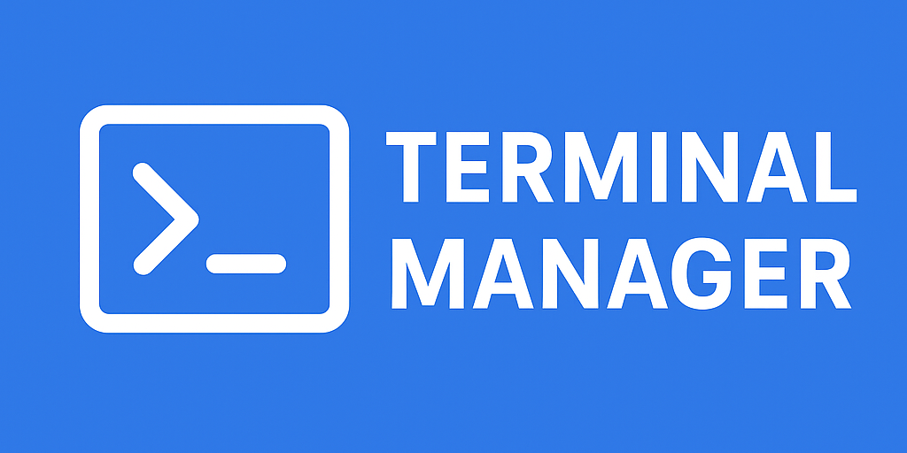

# TERMINAL MANAGER

Terminal Manager automatically creates and manages multiple VS Code terminals based on a JSON configuration file or workspace settings. It simplifies running development scripts or commands by pre-configuring terminals with custom paths, shells, and commands.

## Features

- Create multiple terminals automatically when a project or workspace opens
- Run custom commands in each terminal
- Support for relative and absolute paths
- Custom shell executable per terminal
- Focus on a specific terminal after creation
- Manual execution via Command Palette
- Multi-root workspace support

## Installation

Install directly from the [VS Code Marketplace](https://marketplace.visualstudio.com/) or clone the repository to inspect the code.

## Configuration

The extension can be configured in **two ways**:

### 1. JSON configuration file

Create a file `.vscode/terminal-manager.json` at the root of your project.

You can also specify a **custom path** for the configuration file in the settings:

```json
{
  "terminalExtension.configPath": "./config/terminal-manager.json"
}
```

If no manual path is provided, the extension will look for `.vscode/terminal-manager.json` by default.

Example configuration file at the default location:

```json
{
  "terminals": [
    {
      "name": "Backend",
      "initialPath": "./backend",
      "commands": ["npm run dev"],
      "shellPath": "C:\\Program Files\\Git\\bin\\bash.exe"
    },
    {
      "name": "Frontend",
      "initialPath": "./frontend",
      "commands": ["npm start"]
    }
  ],
  "focusOnTerminal": "Backend",
  "runAutomatically": true
}
```

- initialPath: Relative paths are resolved relative to the project root. Absolute paths are supported.

- commands: Commands to execute in the terminal after creation.

- focusOnTerminal: Terminal to focus after creation by name. Defaults to the last created terminal.

- runAutomatically: If true, terminals are created automatically when the project/workspace opens.

---

### **Configuration: Workspace/User Settings**

### 2. Workspace or User Settings

You can also configure via `settings.json` or `.code-workspace`:

```json
{
  "terminalExtension.configPath": "./config/terminal-manager.json",
  "terminalExtension.terminals": [
    {
      "name": "Backend",
      "initialPath": "./backend",
      "commands": ["npm run dev"]
    }
  ],
  "terminalExtension.focusOnTerminal": "Backend",
  "terminalExtension.runAutomatically": true
}
```

- configPath allows the user to define a custom location for the JSON configuration file. If omitted, the extension defaults to .vscode/terminal-manager.json.

---

### **Configuration Options Table**

## Configuration Options

| Option                        | Type                | Required | Description                                                                                                              |
| ----------------------------- | ------------------- | -------- | ------------------------------------------------------------------------------------------------------------------------ |
| `terminals`                   | `TerminalOptions[]` | ✅       | List of terminals to create. Each terminal supports optional properties: `name`, `initialPath`, `shellPath`, `commands`. |
| `TerminalOptions.name`        | `string`            | ❌       | Terminal name. Defaults to `terminal-<index>`.                                                                           |
| `TerminalOptions.initialPath` | `string`            | ❌       | Working directory for the terminal. Relative to project root if starts with `./`. Defaults to project root.              |
| `TerminalOptions.shellPath`   | `string`            | ❌       | Custom shell executable. Defaults to VS Code default shell.                                                              |
| `TerminalOptions.commands`    | `string[]`          | ❌       | Commands to run on terminal creation.                                                                                    |
| `focusOnTerminal`             | `string \| number`  | ❌       | Terminal to focus after creation (name or index). Defaults to last terminal.                                             |
| `runAutomatically`            | `boolean`           | ❌       | Whether terminals should be created automatically when the workspace opens. Defaults to `false`.                         |

## Usage

### Automatic Terminal Creation

If `runAutomatically` is set to `true`, terminals will be created automatically when the project or workspace opens.

### Manual Terminal Creation

At any time, you can create the terminals manually:

1. Open **Command Palette** (`F1` or `Ctrl+Shift+P`)
2. Search for **[Terminal Manager]: Run Terminals**
3. Execute it to create terminals based on the current configuration.

## Multi-Root Workspace

For workspaces with multiple folders:

- Terminals are created relative to the **first workspace folder** by default.
- Absolute paths are always respected.
- You can define multiple terminals pointing to different folders by specifying `initialPath` accordingly.

## Visual Example

Suppose your project structure is:

```
project-root/
├─ .vscode/
│ └─ terminal-manager.json
├─ backend/
│ └─ package.json
└─ frontend/
└─ package.json
```

With the configuration:

```json
{
  "terminals": [
    {
      "name": "Backend",
      "initialPath": "./backend",
      "commands": ["npm run dev"]
    },
    {
      "name": "Frontend",
      "initialPath": "./frontend",
      "commands": ["npm start"]
    }
  ],
  "focusOnTerminal": "Backend",
  "runAutomatically": true
}
```

- A terminal named Backend will open in project-root/backend and run npm run dev.

- A terminal named Frontend will open in project-root/frontend and run npm start.

- The Backend terminal will be focused automatically after creation.

---

### **Notes and License**

## Notes

- Relative paths are resolved **relative to the root of the project**, even if the configuration file is inside `.vscode`.
- Focus and commands can be customized per terminal.
- Manual execution ensures that terminals can be recreated at any time without reopening the workspace.
- Absolute paths are fully supported, allowing you to open terminals anywhere on your system.

---

## License

[MIT](LICENSE)
